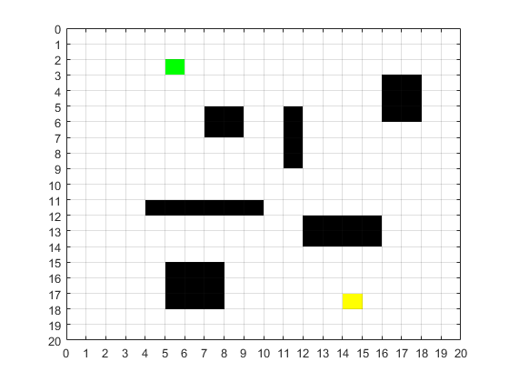
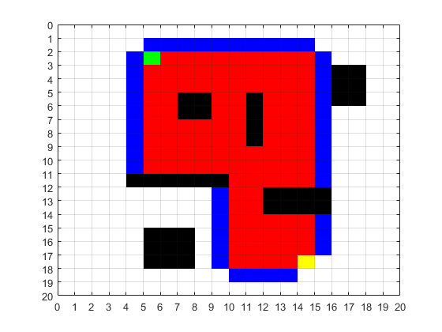
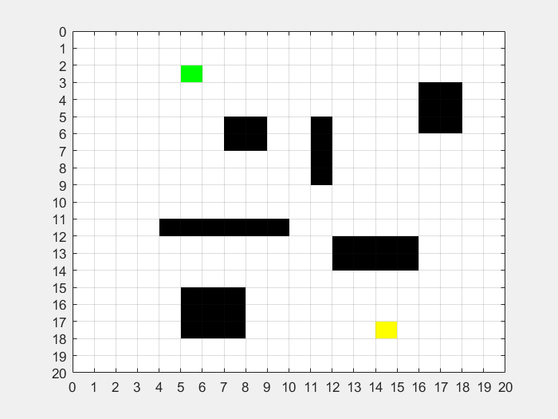

Author: Yash Bansod  
GitHub: https://github.com/YashBansod  

## Clear the environment and the command line

```matlab
clear;
close all;
clc;
```

## Initialize the maps, color maps, start points and destination points

```matlab
map_size = [20, 20];
input_map = false(map_size);              % Create an Input Map

input_map (6:7, 8:9) = 1;           % Add an obstacle
input_map (6:9, 12) = 1;            % Add another obstacle
input_map (12, 5:10) = 1;           % Add another obstacle
input_map (13:14, 13:16) = 1;       % Add another obstacle
input_map (16:18, 6:8) = 1;         % Add another obstacle
input_map (4:6, 17:18) = 1;         % Add another obstacle

start_coords = [3, 6];              % Save the location of start coordinate
dest_coords = [18, 15];             % Save location of destination coordinate

drawMapEveryTime = true;            % To see how nodes expand on the grid

cmap = [1   1   1;                  % Create a color map
    0   0   0;
    1   0   0;
    0   0   1;
    0   1   0;
    1   1   0;
    0.5 0.5 0.5];

colormap(cmap);                     % Sets the colormap for the current figure
[nrows, ncols] = size(input_map);   % Save the size of the input_map

map = zeros(nrows,ncols);           % Create map to save the states of each grid cell
map(~input_map) = 1;                % Mark free cells on map
map(input_map) = 2;                 % Mark obstacle cells on map

start_node = sub2ind(size(map), start_coords(1), start_coords(2));      % Generate linear indices of start node
dest_node = sub2ind(size(map), dest_coords(1), dest_coords(2));         % Generate linear indices of dest node

map(start_node) = 5;                % Mark start node on map
map(dest_node) = 6;                 % Mark destination node on map

distanceFromStart = Inf(nrows,ncols);   % Initialize distance from start array to inifinity
distanceFromEnd = Inf(nrows,ncols);     % Initialize distance from end array to inifinity

parent = zeros(nrows, ncols);           % Create a map for holding parent's index for each grid cell

distanceFromStart(start_node) = 0;  % distance of start node from start is zero
distanceFromEnd(dest_node) = 0;     % distance of end node from end is zero

% Update the values of all grid pixels for distance from end
[X, Y] = meshgrid(1:ncols, 1:nrows);
xd = dest_coords(1);
yd = dest_coords(2);
distanceFromEnd = abs(X - yd) + abs(Y - xd);    % Manhattan Distance

image([0.5, map_size(1)-0.5], [0.5, map_size(2)-0.5], map);
ax = gca;
ax.YTick = 0:1:map_size(1);
ax.XTick = 0:1:map_size(2);
grid on;                        % Display grid lines
% drawnow limitrate nocallbacks;  % Update figure
drawnow;
```



## Process the map to update the parent information and distance from start

```matlab
while true                              % Create an infinite loop
    map(start_node) = 5;                % Mark start node on map
    map(dest_node) = 6;                 % Mark destination node on map

    if (drawMapEveryTime)
        image([0.5, map_size(1)-0.5], [0.5, map_size(2)-0.5], map);
        ax = gca;
        ax.YTick = 0:1:map_size(1);
        ax.XTick = 0:1:map_size(2);
        grid on;                        % Display grid lines
        % drawnow limitrate nocallbacks;  % Update figure
        drawnow;
    end

    % Find the node with the minimum heuristic distance
    heuristicDist = distanceFromStart + distanceFromEnd;
    [min_dist, current] = min(heuristicDist(:));

    % Compute row, column coordinates of current node from linear index
    [i, j] = ind2sub(size(heuristicDist), current);

    % Create an exit condition for the infinite loop to end
    if ((current == dest_node) || isinf(min_dist))
        break
    end

    % Update distance value of element right of current element
    if (i+1 <= nrows && distanceFromStart(i+1, j) > distanceFromStart(i,j) + 1)
        if (parent(i+1, j) == 0 && input_map(i+1,j)~=1 && parent(current)~= sub2ind(size(map), i+1, j))
            distanceFromStart(i+1, j) = distanceFromStart(i,j) + 1;
            map(sub2ind(size(map), i+1, j)) = 4;    % Mark the neighbour of current as processing
            parent(i+1, j)= current;
        end
    end

    % Update distance value of element left of current element
    if (i-1 >= 1 && distanceFromStart(i-1, j) > distanceFromStart(i,j) + 1)
        if (parent(i-1, j) == 0 && input_map(i-1,j)~=1 && parent(current)~= sub2ind(size(map), i-1, j))
            distanceFromStart(i-1, j) = distanceFromStart(i,j) + 1;
            map(sub2ind(size(map), i-1, j)) = 4;    % Mark the neighbour of current as processing
            parent(i-1, j)= current;
        end
    end

    % Update distance value of element top of current element
    if (j-1 >= 1 && distanceFromStart(i, j-1) > distanceFromStart(i,j) + 1)
        if (parent(i, j-1) == 0 && input_map(i,j-1)~=1 && parent(current)~= sub2ind(size(map), i, j-1))
            distanceFromStart(i, j-1) = distanceFromStart(i,j) + 1;
            map(sub2ind(size(map), i, j-1)) = 4;    % Mark the neighbour of current as processing
            parent(i, j-1)= current;
        end
    end

    % Update distance value of element bottom of current element
    if (j+1 <= ncols && distanceFromStart(i, j+1) > distanceFromStart(i,j) + 1)
        if (parent(i, j+1) == 0 && input_map(i,j+1)~=1 && parent(current)~= sub2ind(size(map), i, j+1))
            distanceFromStart(i, j+1) = distanceFromStart(i,j) + 1;
            map(sub2ind(size(map), i, j+1)) = 4;    % Mark the neighbour of current as processing
            parent(i, j+1)= current;
        end
    end

    distanceFromStart(current) = -log(0);   % change the distance of current from start as infinity
    map(current) = 3;                       % mark the current point as processed
end
```



## Construct route from start to dest by following the parent links

```matlab
if (isinf(distanceFromStart(dest_node)))
    route = [];    % if distance to destination node is infinity
else
    route = [dest_node];                               % else backtrace the route from destination node
    while (parent(route(1)) ~= 0)                       % check front of route for start node
        route = [parent(route(1)), route];              % add parent of current node to front of route
    end

    for k = 2:length(route) - 1         % To visualize the map and the path
        map(route(k)) = 7;
        pause(0.001);                   % Pause the code for a while
        image([0.5, map_size(1)-0.5], [0.5, map_size(2)-0.5], map);
        ax = gca;
        ax.YTick = 0:1:map_size(1);
        ax.XTick = 0:1:map_size(2);
        grid on;                        % Display grid lines
        % drawnow limitrate nocallbacks;  % Update figure
        drawnow;
    end
end

% Add legends to the colormapped image
hold on;
for K = 1:7
    hidden_h(K) = surf(zeros(2, 2), 'edgecolor', 'none', ...
        'facecolor', cmap(K, :));
end
hold off

uistack(hidden_h, 'bottom');
legend(hidden_h, {'free space', 'obstacles', 'closed nodes', ...
    'open nodes', 'start node', 'goal node', 'shortest path'} )
```


## Results

